<div align="center">



<br />

A fast, clean **code tree sidebar for GitHub** — a Manifest V3 browser extension
built with TypeScript and [Bun](https://bun.sh). Browse any repository without
constant page loads. Everything runs locally: **no backend, no telemetry.**

<br />

[](https://github.com/decryptable/octonext/actions/workflows/ci.yml)
[](https://github.com/decryptable/octonext/releases)
[](./LICENSE)
[](./src/manifest.config.ts)
[](./tsconfig.json)
[](https://bun.sh)
[](#privacy)

<br />


<br />

[Install](#install-from-source) ·
[Features](#features) ·
[Themes](#themes) ·
[Architecture](./ARCHITECTURE.md) ·
[Contributing](./CONTRIBUTING.md) ·
[Support](#support)

</div>

---

## Why OctoNext

GitHub's web UI reloads the whole page every time you open a folder or file.
OctoNext renders a persistent, collapsible file tree beside the page, fed by the
GitHub REST API with lazy folder loading. Navigate, search, download, and review
pull requests without ever leaving the tab.

GitHub sign-in is **only** needed for private repositories: paste a personal
access token on the options page. The token is validated against GitHub before
it is saved and lives in `chrome.storage` — it never goes anywhere else.

## Project stats

<div align="center">

<a href="https://github.com/decryptable/octonext">
  
</a>
<a href="https://github.com/decryptable/octonext/graphs/contributors">
  
</a>

<br /><br />

[](https://github.com/decryptable/octonext/stargazers)
[](https://github.com/decryptable/octonext/network/members)
[](https://github.com/decryptable/octonext/issues)
[](https://github.com/decryptable/octonext/pulls)


</div>

> The cards above populate automatically once the repository is public.

<br />

<details open>
<summary><b>Features</b></summary>

<br />

| Area | What you get |
| --- | --- |
| **File tree** | Collapsible sidebar on `github.com` repo pages, lazy-loaded folders, expand all / collapse all, keyboard navigation, custom scrollbars |
| **Icons** | VS Code file icons via Material Icon Theme, plus a minimal pack |
| **Themes** | 17 themes including 5 animated ones — see [Themes](#themes) — with **live preview** in settings |
| **Fonts** | 8 bundled coding fonts or system stacks, with live preview and adjustable size |
| **Search** | Instant fuzzy file filtering with match highlighting |
| **Pull requests** | Rich PR panel with a stats summary, searchable + paginated changed files, and review comments — more detail than the GitHub page, no navigation required |
| **Download** | Checkbox selection; a single file downloads directly, multiple files or folders become a path-preserving ZIP |
| **Sizes** | Total repo size in the header, plus per-folder and per-file sizes |
| **Bookmarks** | Save repositories locally and jump back any time |
| **Layout** | Dock left or right, resize, pin open, drag the toggle to any height |
| **Enterprise** | GitHub Enterprise via per-domain opt-in (right-click the toolbar icon) |

</details>

<details>
<summary><b>Pull request panel</b></summary>

<br />

The PR panel pulls everything from the API so you never have to open the diff
page just to see what changed:

- **Summary header** — open / merged / closed / draft state, title, author,
  `base ← head` branches, and totals for changed files, additions, deletions,
  commits, and review comments.
- **Searchable changed files** — type to filter with live match highlighting;
  results are cached in memory so filtering never re-fetches.
- **Pagination** — large diffs page through in fixed chunks instead of one
  endless scroll, with an `X–Y of N` indicator.
- **Labels and reviewers** — surfaced as chips right in the sidebar.
- **Jump to anything** — click a file to scroll straight to its diff, or a
  comment to open it in context.

</details>

<details>
<summary><b>Install (from source)</b></summary>

<br />

```bash
bun install
bun run build      # outputs the unpacked extension to dist/
```

- **Chrome / Edge** — open `chrome://extensions`, enable Developer mode, click
  **Load unpacked**, and select `dist/`.
- **Firefox** — run `bun run package` and load
  `release/octonext-firefox-vX.Y.Z.zip` via `about:debugging` → This Firefox →
  Load Temporary Add-on.

</details>

<details>
<summary><b>Packaging for the stores</b></summary>

<br />

```bash
bun run package
```

Produces store-ready and self-distribution artifacts in `release/`:

| Artifact | Target |
| --- | --- |
| `octonext-chrome-vX.Y.Z.zip` | Chrome Web Store (MV3, service worker) |
| `octonext-chrome-vX.Y.Z.crx` | Signed CRX3 for direct Chrome install |
| `octonext-firefox-vX.Y.Z.zip` | Firefox Add-ons upload |
| `octonext-firefox-vX.Y.Z.xpi` | Installable Firefox package |

The CRX is signed with a key in `keys/octonext.pem`, generated on first run and
kept out of version control. Keep it safe to preserve a stable extension ID.

</details>

<details>
<summary><b>Development</b></summary>

<br />

```bash
bun run dev             # rebuild on change into dist/ (fast incremental)
bun run typecheck       # strict TypeScript checks
bun run test            # unit tests for the core logic
bun run lint:structure  # every file <=130 lines, no comments, kebab-case
bun run format          # Prettier
```

This project enforces a deliberately tight structure: **no source file exceeds
130 lines**, comments are disallowed in `src` (the code is the documentation),
and filenames are kebab-case. The rules run in CI via a TypeScript-compiler-aware
checker — see `scripts/check/rules.ts`.

</details>

## Themes

17 themes, picked live from the options page with an instant preview. The last
five are animated — motion on folder open/close, clicks, ripples, and hovers.

<details>
<summary><b>Full theme list</b></summary>

<br />

| Static | Animated |
| --- | --- |
| Auto (system) | Pixel |
| GitHub Light / Dark / Dark Dimmed | Cute |
| One Dark | Retro CRT |
| Dracula · Nord · Monokai | Hacker |
| Solarized Light / Dark | Synthwave |
| Gruvbox Dark · Tokyo Night | |

</details>

## Privacy

OctoNext has no servers and collects nothing. The only network requests it makes
are to the GitHub API for the repository you are viewing. A personal access
token, if you provide one, is stored in `chrome.storage` and sent **only** to
GitHub. There is no analytics, no tracking, and no phone-home.

## Tech stack

- **Bun** — package manager, bundler, test runner, and asset pipeline
- **TypeScript** (strict) — all source, no UI framework
- **material-icon-theme** — VS Code file icons
- **@fortawesome/\*** — UI icons
- **webextension-polyfill** — cross-browser `browser.*` APIs

See [`ARCHITECTURE.md`](./ARCHITECTURE.md) for the source map and data flow, and
[`CONTRIBUTING.md`](./CONTRIBUTING.md) to get involved.

## Support

OctoNext is free and will stay that way. If it saves you time, optional and
entirely voluntary support keeps it maintained:

<a href="https://saweria.co/decryptable" target="_blank" rel="noreferrer">
  
</a>

## License

[MIT](./LICENSE) © [decryptable](https://github.com/decryptable)
